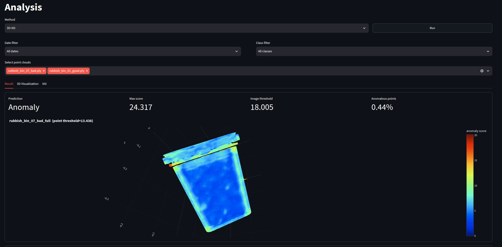

## 0. 설치

- 필요한 패키지를 설치합니다.

```bash
pip install -r requirements.txt

cd third_party/OpenXAI
pip install -e .
```

- XAI 기능을 사용하려면 `OpenXAI` 설치가 필요합니다.
- LLM 모델을 다운로드합니다.
  - `model` 폴더에 저장합니다.
  - 모델 폴더 이름은 앱에서 기대하는 이름과 정확히 일치해야 합니다.
  - [Gemma](https://huggingface.co/google/gemma-4-E4B-it)
  - 다른 LLM 모델도 사용할 수 있습니다.

## 1. 데이터베이스 연결

### 방법 1. 샘플 데이터셋
<p align="center"></p>

- DB가 연결되어 있지 않으면 기본 샘플 데이터로 앱이 실행됩니다.
- 앱을 실행하면 아래 화면이 나타납니다. 분석할 데이터 기간을 설정한 뒤 `Load Data` 버튼을 클릭해 시작합니다.


### 방법 2. 데이터베이스 - Supabase
- `.streamlit/secrets.toml` 파일을 생성합니다.
- 아래와 같이 DB 연결 설정을 추가합니다. 현재 Supabase만 지원합니다.
- `Setting` 페이지에서 `DB Settings`를 클릭해 DB 연결 설정을 변경할 수 있습니다.

```toml
[connections.supabase]
SUPABASE_URL = "http://000.0.0.0:12345"
SUPABASE_KEY = "abcdefghij"
```


## 2. Dashboard 페이지
<p align="center"></p>

- `Summary`, `Detail`, `Fine-tuning`, `Setting`, `Log` 페이지의 요약 정보를 보여줍니다.
- 페이지 상단에서 데이터 기간을 설정하고 `Load Data`를 클릭합니다. 샘플 데이터의 경우 기본 날짜 값을 그대로 사용합니다.
- `Load Data`를 클릭하지 않으면 추론 및 기타 기능이 실행되지 않습니다.

## 3. Summary 페이지
<p align="center"></p>
- 데이터 분석 요약을 보여줍니다.
<p align="center"></p>
- `Download Report`를 클릭하면 현재 요약 내용을 PDF 파일로 저장합니다.

## 4. Analysis 페이지
<p align="center"></p>

- 이미지에 대한 상세 AI 추론 결과와 관련 분석 기능을 제공합니다. `Select images`에서 이미지를 선택해야 분석이 시작되며 날짜 및 클래스 필터를 사용할 수 있습니다.
- 2D 이미지 이상 탐지 : (`Classification`, `Anomaly Detection`)
  - (Dashboard `3D Rubbish bin` 테이블 선택시 사용 가능한 기능입니다.)
  - `Method` 선택기로 `Classification`과 `Anomaly Detection`을 전환합니다.
    - `Anomaly Detection` 모드에서 사이드바의 `Run Anomaly Detection`을 클릭하면 선택한 이미지의 특징을 추출하고, PatchCore 기반 스코어러로 메모리 뱅크와 비교해 점수를 계산합니다.
      <p align="center"></p>

  - `Result` 탭은 `Classification` 모드에서는 예측 클래스와 이미지를, `Anomaly Detection` 모드에서는 각 이미지의 이상 점수와 (보정된 임계값 기준) Normal/Anomaly 예측을 보여줍니다.

  - `3D Visualization` 탭은 선택한 이미지의 특징을 저차원으로 압축해 시각화합니다(`Classification` 모드에서는 PCA, t-SNE, UMAP, `Anomaly Detection` 모드에서는 패치 평균 후 PCA로 압축한 특징). 이미지를 3장 이상 선택해야 동작합니다.
    <p align="center"></p>

  - `XAI` 탭은 `Classification` 모드에서 OpenXAI를 사용해 모델 예측을 해석하도록 돕습니다. `Anomaly Detection` 모드에서는 이 탭이 `Anomaly Heatmap`으로 바뀌며, 각 이미지 위에 PatchCore 이상 맵을 겹쳐 보여줍니다.
    <p align="center"></p>

- 3D 포인트 클라우드 이상 탐지 (`3D-KD`)
  <p align="center"></p>

  - Dashboard 페이지에서 `3D Rubbish bin` 테이블을 선택하면 Analysis 페이지가 3D 포인트 클라우드 모드로 전환됩니다.
  - `Method`는 `3D-KD`(Teacher–Student 지식 증류)만 사용할 수 있습니다.
  - `Select point clouds`에서 포인트 클라우드(`.ply`)를 선택한 뒤 `Run`을 클릭합니다. `outputs/3D-AD`에 저장된 결과가 있으면 다시 추론하지 않고 불러오며, 나머지는 추론 후 해당 폴더에 저장합니다.
  - `Result` 탭에서는 포인트 클라우드별 `Prediction`(Normal/Anomaly), `Max score`, `Image threshold`, `Anomalous points`(%)와 함께, 포인트별 이상 점수로 색칠된 인터랙티브 3D 뷰를 보여줍니다.
  - 포인트 클라우드 데이터에서는 `3D Visualization`과 `XAI` 탭을 사용할 수 없습니다.
## 5. Setting
<p align="center"></p>

- `DB Settings`: DB 연결 키 값을 입력합니다.
- `LLM Runtime`: 왼쪽 사이드바와 Summary 분석에서 사용하는 LLM 모델 옵션입니다.

## 6. Log
<p align="center"></p>
- 앱 사용 중 생성된 로그를 확인할 수 있습니다.
- 로그는 `log` 폴더에 날짜별로 자동 저장됩니다.

## 7. 사이드바: LLM
<p align="center"></p>

- 사이드바의 명령 입력창을 통해 LLM과 대화할 수 있습니다.


